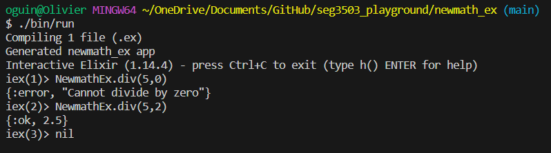

# Synopsis
This is a small test repository made for SEG3503, lab 1 to test git functionnality.

# Motivation
This repository tests github functionnalities.

# Contributors
- oguindon

# License
No license has been atributed to this project.

# Screenshots

newmath_java ./bin/run:

newmath_java ./bin/test:

newmath_ex ./bin/run:

newmath_ex ./bin/test:
