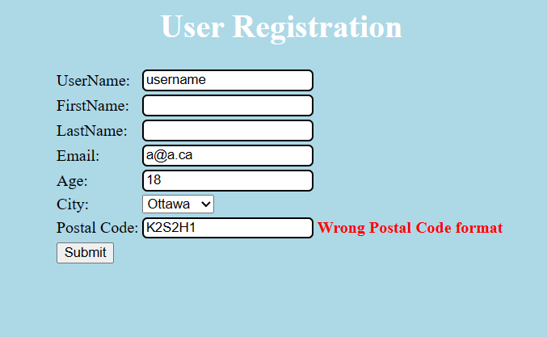
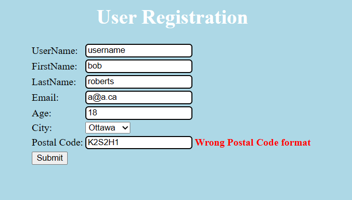
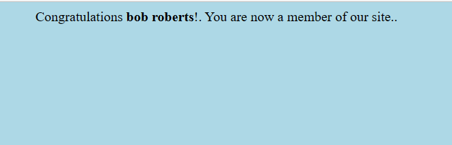
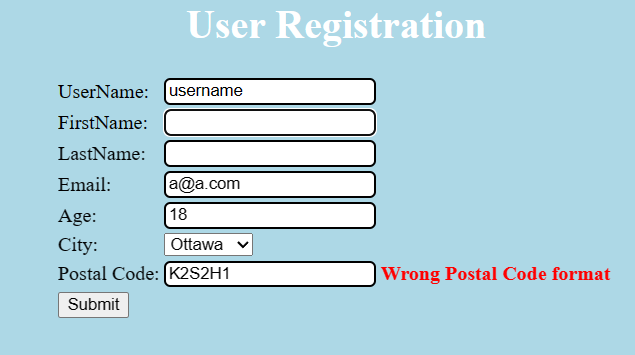
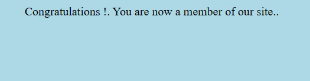
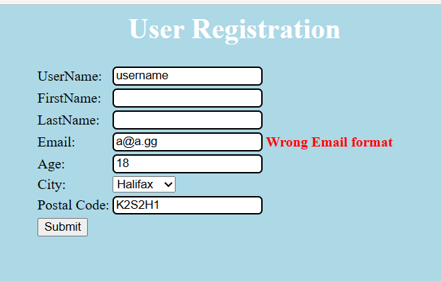
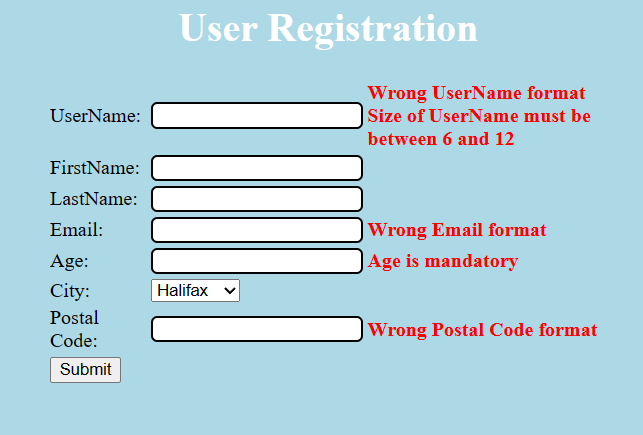

# Lab 2
Nom: Olivier Guindon

Numéro d'étudiant: 300236168

# Github
Lien: [https://github.com/oguindon/seg3503_playground.git](https://github.com/oguindon/seg3503_playground)

# Résumé:

Pour l'exercise 1, j'ai trouvé divers cas d'erreur en utilisant la methode essai-erreur.
J'ai entré plusieurs données dans le site pour trouver les cas d'erreur.

Pour l'exercise 2, j'ai implémenté les classes DateTest.java,
DateNextDateExceptionTest.java et DateNextDateOkTest.java.
Je me suis inspiré des classes BitTest.java et BitAndTest.java pour
la conception du code.

# Exercise 1:
| Errors | Definitions |
| ------ | ----------- |
| Err 1 | Wrong UserName format |
| Err 2 | Size of Username must be between 6 and 12 |
| Err 3 | Wrong FirstName format |
| Err 4 | Wrong LastName format |
| Err 5 | Wrong Email format |
| Err 6 | Age is mandatory |
| Err 7 | Age "must be less than or equal to 64" |
| Err 8 | Age is not int (wrong data type) |
| Err 9 | Wrong postal code format |

| Cas de Test | Résultat Escomptes | Résultats Actuels | Verdict |
| ----------- | :----------------: | ----------------- | :-----: |
| 1 - Entrées valides | Accepté | Accepté   | Succèss |
| 2 - Valide avec prenom et nom | Accepté | Accepté  | Succèss |
| 3 - Valide avec adresse courriel .com | Accepté | Accepté  | Succèss |
| 4 - Valide avec adresse courriel .gg | Accepté | Accepté  | Succèss |
| 5 - Invalide aucune entrée | Err1, Err2, Err5, Err6, Err9 | Err1, Err2, Err5, Err6, Err9:  | Échec |
