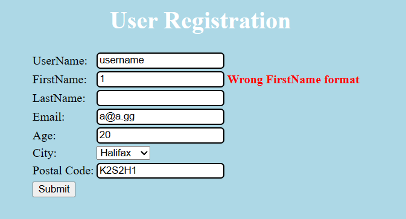

# Lab 2
Nom: Olivier Guindon

Numéro d'étudiant: 300236168

# Github
Lien: [https://github.com/oguindon/seg3503_playground.git](https://github.com/oguindon/seg3503_playground)

# Résumé:

Pour l'exercise 1, j'ai trouvé divers cas d'erreur en utilisant la methode essai-erreur.
J'ai entré plusieurs données dans le site pour trouver les cas d'erreur.

Pour l'exercise 2, j'ai implémenté les classes DateTest.java,
DateNextDateExceptionTest.java et DateNextDateOkTest.java.
Je me suis inspiré des classes BitTest.java et BitAndTest.java pour
la conception du code.

# Exercise 1:

| Cas de Test | Résultat Escomptes | Résultats Actuels | Verdict |
| ----------- | ------------------ | ----------------- | ------- |
| 1 - entrées valides | accepted |  |  |
|||||
