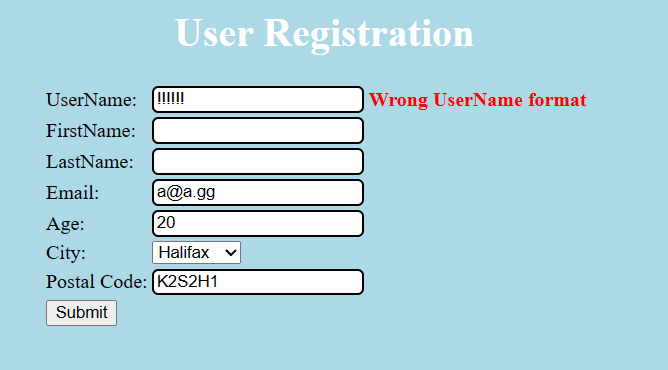
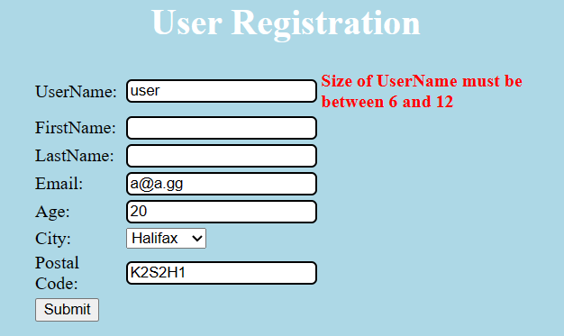
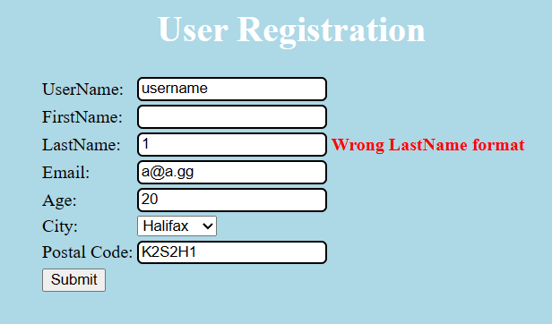
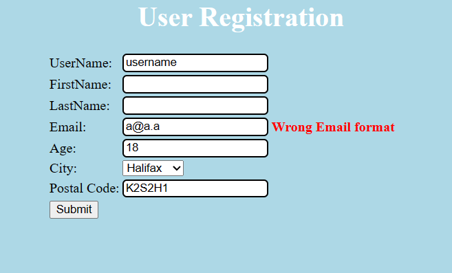
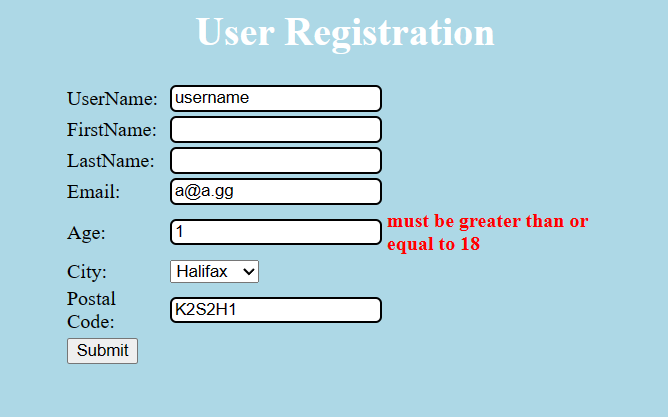
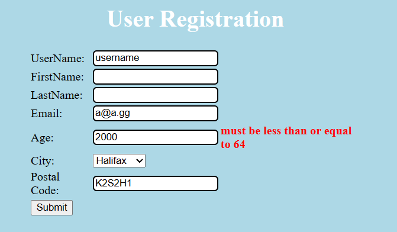
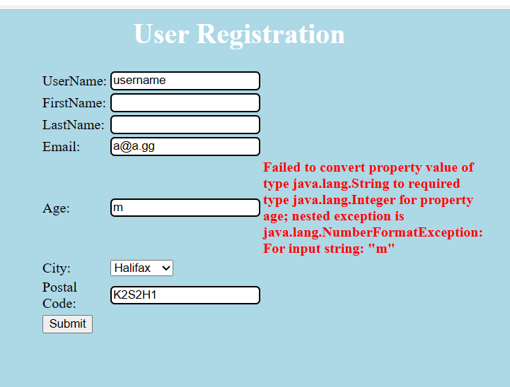
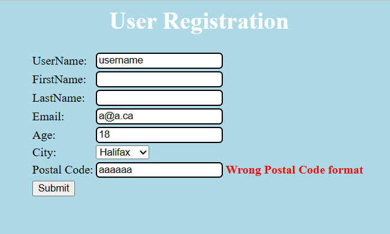

# Lab 2
Nom: Olivier Guindon

Numéro d'étudiant: 300236168

# Github
Lien: [https://github.com/oguindon/seg3503_playground.git](https://github.com/oguindon/seg3503_playground)

# Résumé:

Pour l'exercise 1, j'ai trouvé divers cas d'erreur en utilisant la methode essai-erreur.
J'ai entré plusieurs données dans le site pour trouver les cas d'erreur.

Pour l'exercise 2, j'ai implémenté les classes DateTest.java,
DateNextDateExceptionTest.java et DateNextDateOkTest.java.
Je me suis inspiré des classes BitTest.java et BitAndTest.java pour
la conception du code.

# Exercise 1:
| Errors | Definitions |
| ------ | ----------- |
| Err 1 | Wrong UserName format |
| Err 2 | Size of Username must be between 6 and 12 |
| Err 3 | Wrong FirstName format |
| Err 4 | Wrong LastName format |
| Err 5 | Wrong Email format |
| Err 6 | Age is mandatory |
| Err 7 | Age "must be less than or equal to 64" |
| Err 8 | Age is not int (wrong data type) |
| Err 9 | Wrong postal code format |
| Err 10 | Age must be greater than or equal to 18 |

| Cas de Test | Résultat Escomptes | Résultats Actuels | Verdict |
| ----------- | :----------------: | ----------------- | :-----: |
| 1 - Entrées valides | Accepté | Accepté (Message d'erreur date d'un autre essai)  | Succèss |
| 2 - Valide avec prenom et nom | Accepté | Accepté (Message d'erreur date d'un autre essai)  | Succèss |
| 3 - Valide avec adresse courriel .com | Accepté | Accepté (Message d'erreur date d'un autre essai)  | Succèss |
| 4 - Valide avec adresse courriel .gg | Accepté | Accepté (Message d'erreur date d'un autre essai) | Succèss |
| 5 - Invalide aucune entrée | Err1, Err2, Err5, Err6, Err9 | Err1, Err2, Err5, Err6, Err9:  | Échec |
| 6 - Wrong Username format | Err1 | Err1:  | Échec |
| 7 - Wrong Username size | Err2 | Err2:  | Échec |
| 8 - Wrong Firstname format | Err3 | Err3:  | Échec |
| 9 - Wrong Lastname format | Err4 | Err4:  | Échec |
| 10 - Wrong Email format | Err5 | Err5:  | Échec |
| 11 - Too young age | Err10 | Err10:  | Échec |
| 12 - Too old age | Err7 | Err7:  | Échec |
| 13 - Age is a string | Err8 | Err8:  | Échec |
| 14 - Wrong postal code format | Err9 | Err9:  | Échec |

