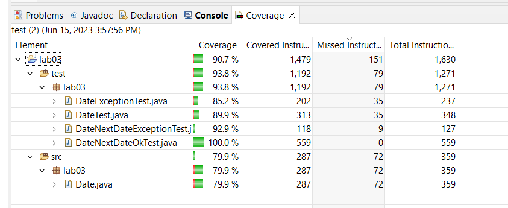
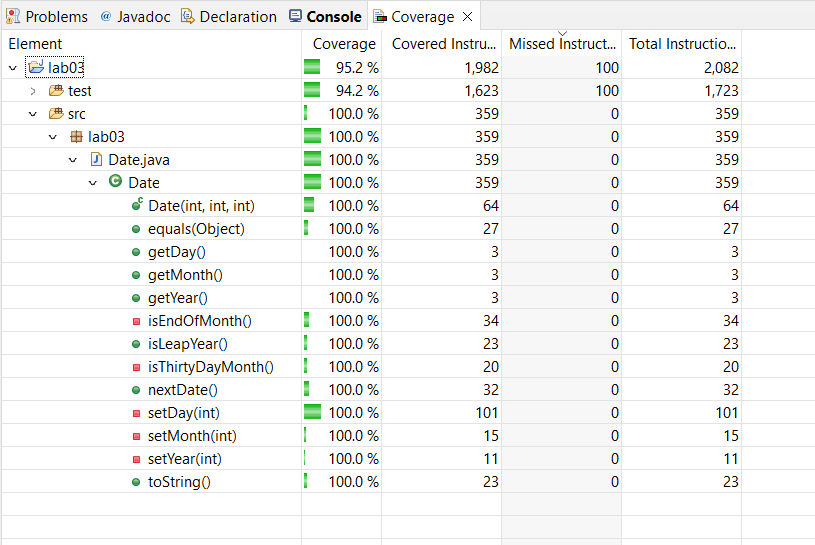

# Lab 3
Nom: Olivier Guindon

Numéro d'étudiant: 300236168

Courriel: oguin073@uottawa.ca

# Github
Lien: [https://github.com/oguindon/seg3503_playground.git](https://github.com/oguindon/seg3503_playground)

# Résumé:

J'ai fait des très petits changements à Data.java lors de la refactorization.
Les changements ne font que simplifier certaines methodes en enlevant les "else" redondants ou en déclarant plusieurs variables sur une seule ligne.

J'ai ajouté plusieurs tests pour avoir un "coverage" de 100%. Il y a un test pour la method toString, plusieurs tests pour la method equals et d'autres tests pour la génération de Dates.

# "Coverage" inital:

# "Coverage" final:

