# Lab 4
Nom: Olivier Guindon

Numéro d'étudiant: 300236168

Courriel: oguin073@uottawa.ca

# Github
Lien: [https://github.com/oguindon/seg3503_playground.git](https://github.com/oguindon/seg3503_playground)

# Résumé:

Ce laboratoire contient 5 groupes de commits, chacun démontrant un test qui échoue, un test qui réussi et une réfactorisation.

| Nom du groupe de commits | Numéro de commit | Description |
| --- | --- | --- |
| Constructor Test | Failed: 71a188b4112f1a65e50dcbe1214633f1f59fceec   Passed: 012a05c1804382fe5178ed5bbcb81d977d689c02   Refactor: 37c2e22772d81f3170c55c91716edb8b492d0405 | Ce groupe de commits a pour but de tester la fonctionnalité du constructeur. Plus spécifiquement, on vérifie quedeux éléments créé avec les mêmes paramètres sont identiques. Ci-dessous on peut voir le code initial: 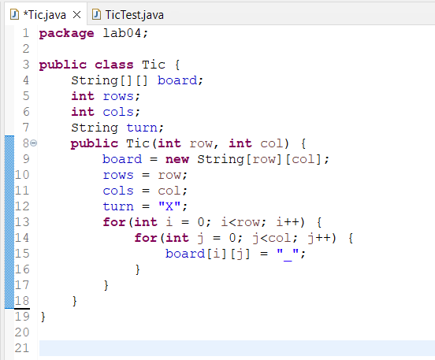 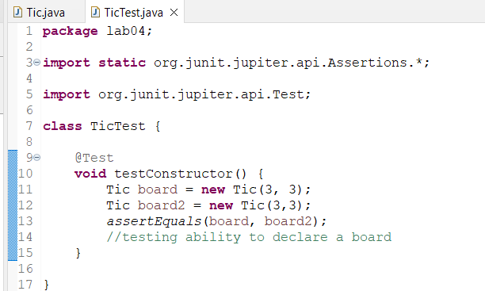   Ce code a échoué: 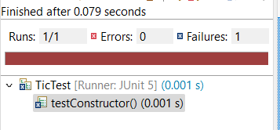   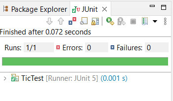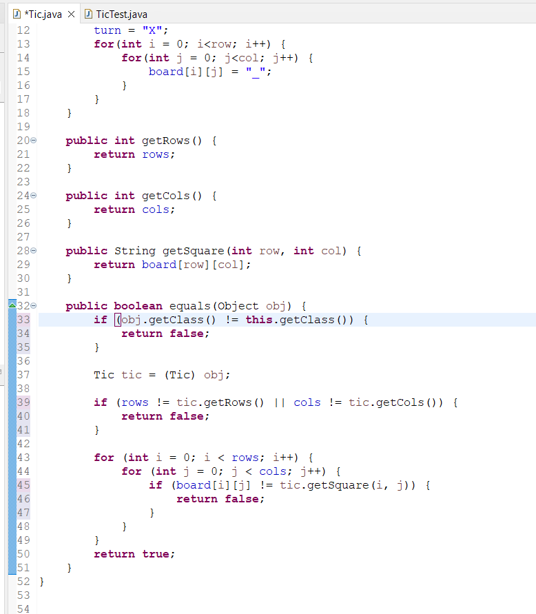 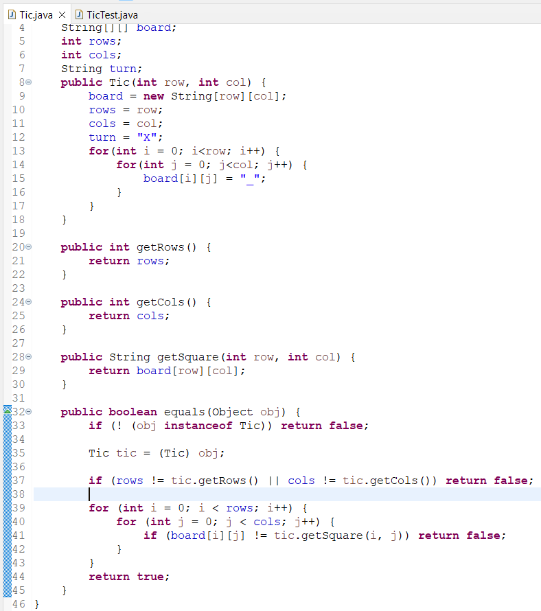|
| Test constructor if row is 0 | Failed: 6a6a9b1f4baf6319a1be1e035632806f2aa0a930   Passed: 09bb236283c96f624a93bf02f4bee6cfd9e1ded1   Refactor: ca17d4e0f420babf4f72f90219d6e8fd6f93b4a5 | 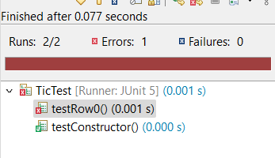 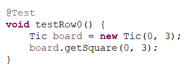 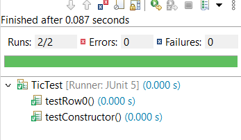 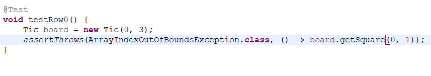 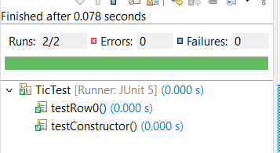 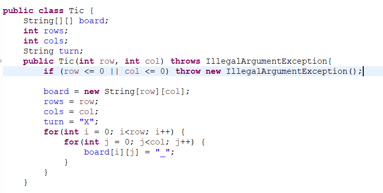 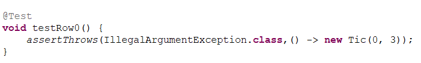|
| Test getSquare with index out of bounds | Failed: 6bccc7c165c5903462ab1977218e697f4a13bc19   Passed: ef2eedf1a593b917afe02e95e62c2da147776d6e   Refactor: 2b42c738ac1f752f7e46f667bf45216cf981652d | 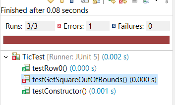 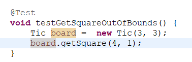 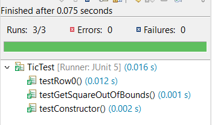 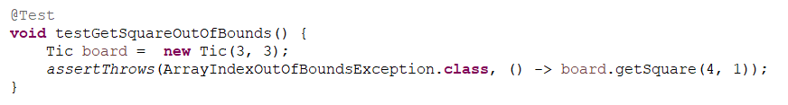 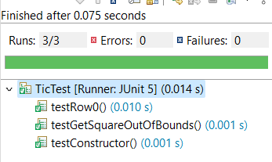 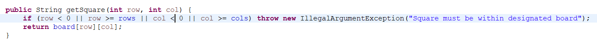 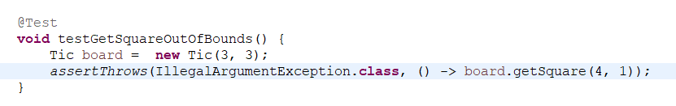|
| Test if boards are not equal | Failed: 48dbdbb307cbe70a0de1c140d30505b014a2e5b7   Passed: 5acc34c794d66dc6de722763b2e987b827b6010e   Refactor: ce74b1a700ec65b39bf9a2bf5bc79a9d5b118921 | |
| Test equals method with non Tic object | Failed: 0a504fc81a5939a0e6dd23fd453e6c07b45fd4d1   Passed: 60e950f7f2967bc0b295230a60c057db95f253c4   Refactor: 478cd6eb388b2643c9e0fac03a96ed65334c0c27 | |

