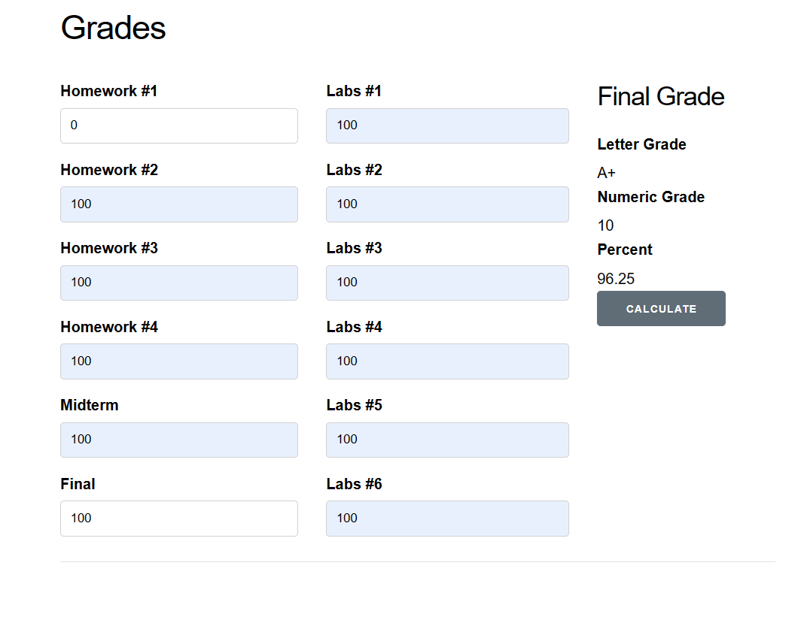
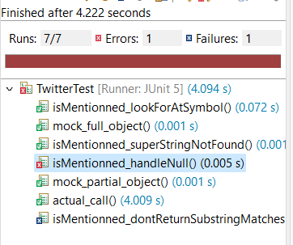
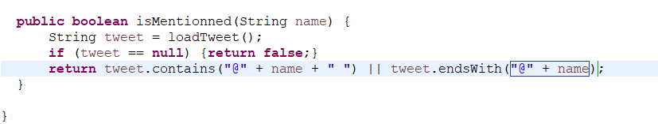
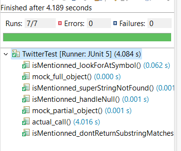

# Lab 5
Nom: Olivier Guindon

Numéro d'étudiant: 300236168

Courriel: oguin073@uottawa.ca

# Github
Lien: [https://github.com/oguindon/seg3503_playground.git](https://github.com/oguindon/seg3503_playground)

# Résumé:

Ce laboratoire a deux parties:
- Grades: Utiliser elixir pour afficher la note final d'un étudiant
- Twitter: Utiliser java et des mocks pour tester la classe Twitter

# Grades:
| Commit | Numéro de commit | Description |
| --- | --- | --- |
| Code Initial | e3bda759df4f1fa61849e2be205e88cd89335c2f | Ici on peut voir l'état initial du code avant d'implémenter les méthodes stub ou mock. |
| Implémentation du stub pour Grades.Calculator() | 2da6f9077c3a0753e3888eebc4132c26783f69e7 | Le bouton pour afficher la note finale n'affiche plus d'erreur grâce à la méthode stub. |
| Implémentation de Grades.Calculator() | 51d3539352c28c9a6482388cc98dcfe59b3e95ec | La note finale est correctement affichée comme pourcentage, lettre et valeur numérique.    |

# Twitter:
| Commit | Numéro de commit | Description |
| --- | --- | --- |
| Implémentation des 4 tests mock | 2ee5a087057e5ce9d633c1cd2179d6ee6a6b3645 | Les 4 tests mock ont été créé. 2 ont réussi immédiatement mais les deux autres ont échoué ou sont érronés.      isMentionned_handleNull est érroné puisque la méthode isMentionned essaye de vérifier un string null. isMentionned_dontReturnSubstringMatches a échoué puisque isMentionned ne vérifie que si le nom est contenu dans le tweet. |
| Amélioration de isMentionned() | 2878136358d0ab0e7b527150ae9977ea4b289067 | J'ai amélioré isMentionned pour que tout les tests réussissent.   |    |
